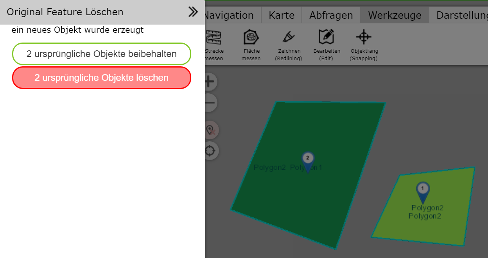

Multipart Geo-Objekte erstellen (merge)
=======================================

Mit diesem Werkzeug kann aus mehreren Objekten ein *Multipart Objekt* erstellt werden.
Das Ergebnis ist ein Geo-Objekt mit mehreren Geometrie Abschnitten.
Voraussetzung ist, dass die entsprechenden Geo-Objekte
mit einem Abfragewerkzeug ausgewählt (selektiert) in der Karte angezeigt werden.
Außerdem müssen für diesen Vorgang mindestens zwei Geo-Objekt ausgewählt sein.

Wechselt man zum Bearbeiten (Edit) Werkzeug, wird das *Multipart erstellen* Werkzeug angeboten:

Klickt man auf das Werkzeug, öffnet sich ein neuer Dialog ``Multipart erstellen``. Da beim 
Erstellen eines *Multipart Objektes* aus vielen Objekten exakt ein Objekt erstellt wird,
muss man sich im nächsten Schritt entscheiden aus welchem der ursprünglichen Objekte die 
Sachdaten auf das neue Objekt übertragen werden sollen:

Dazu bietet der Dialog eine Auswahlliste, in der die einzelnen Ids der ursprünglichen Objekte 
aufgelistet werden. Ändert man hier die Id, ändern sich in der Ansicht die Sachdaten für das 
entsprechende Objekt. In der Karte wird das aktuelle Objekte *rot* umrandet dargestellt.

Sind die Sachdaten des richtigen Objektes ausgewählt, können die Objekte mit ``Zusammenfügen``
zu einem *Multipart Objekt* zusammengefügt werden. Nach dem *Zusammenfügen* kann man noch entscheiden,
ob die ursprünglichen Objekte gelöscht werden sollen:

