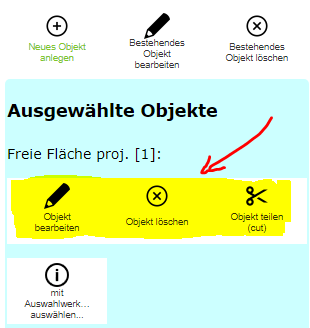

Ausgewählte Objekte bearbeiten
==============================

Für die oben gezeigten Bearbeitungsmethoden mussten bestehende Objekte immer erst durch einen Klick ausgewählt werden.
Wurde das gewünschte Objekte bereits über eine Abfrage oder eine Suche in der Karte ausgewählt (selektiert),
können die oben gezeigten Schritte auch direkt ausgeführt werden.

Ist ein editierbares Objekt ausgewählt und man wechselt zum Bearbeitungs Werkzeug erscheinen für die aktuelle
Auswahl *direkt Bearbeitungswerkzeuge*:

Je nach Berechtigung ist das Bearbeiten und Löschen dieses Objektes (ohne den zusätzlichen Schritt des Anklickens)
möglich. Außerdem stehen abhängig von Geometrietyp und Anzahl der ausgewählten Objekte noch zusätzlich Werkzeuge zur
Verfügung:

* **Teilen (cut):** Wenn genau ein Flächen- oder Linienobjekt ausgewählt ist.
* **Mulitpart auftrennen (explode):** Wenn genau ein Linien- oder Flächenobjekt ausgewählt ist, dessen Geometrie aus mehreren Abschnitten (Teilflächen) besteht.
* **Zusammenführen (merge):** Wenn mehrere Objekte ausgewählt wurden.
* **Massenattributierung:** Wenn mehrere Objekte ausgewählt sind und Massenattributierung für den Objekttyp vom Kartenautor erlaubt wurden.

.. toctree::
   :maxdepth: 3

   edit_cut
   edit_merge
   edit_explode
   edit_massattributation

.. note::
   **Profitipp:** Editwerkeug aus Liste der Ergebnisse aufrufen

.. note::
   Editwerkzeug zum Selektieren/Auswählen verwenden