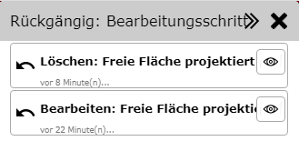
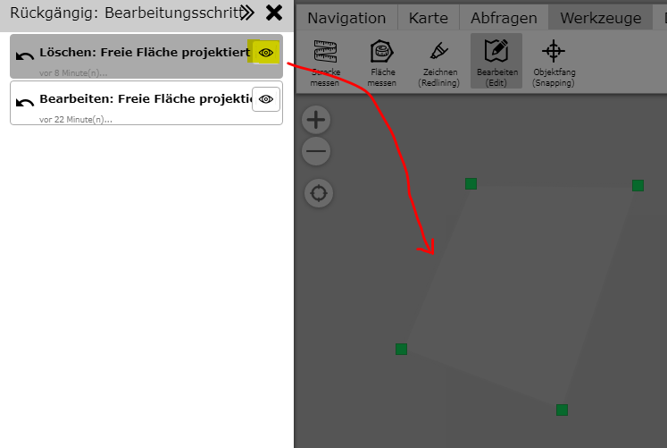

Bearbeitungsschritt rückgängig machen (Undo)
============================================

.. note::
   Eine Undo Funktion steht nicht für jeden Kartendienst Type zur Verfügung. Man sollte sich beim 
   Bearbeiten daher nicht darauf verlassen, dass das Update auch angeboten wird.

Mit diesem Werkzeug können Bearbeitungsschritte wieder Rückgängig gemacht werden. Rückgängig gemacht werden können:

* Bestehendes Objekt bearbeiten
* Bestehendes Objekt löschen

Ist *Undo* möglich, erscheint nach dem Löschen/Bearbeiten von bestehenden Objekten im Edit-Werkzeugdialog (unten)
eine Button:

Klickt man auf diesen Button, öffnet sich der ``Rückgängig: Bearbeitungsschritt`` Dialog: 

Hier werden alle Bearbeitungsschritte (bearbeiten und löschen) aufgelistet. Die Reihenfolge entspricht der 
umgekehrten zeitlichen Abfolge der Bearbeitung (letzter zuerst). Ist man sich nicht sicher, welcher Schritt
rückgängig gemacht werden sollte, kann eine Vorschau über das *Auge-Symbol* erfolgen. Damit wird die Bearbeitung 
nicht sofort rückgängig gemacht, sondern in der Karte eine Vorschau der Änderungen (nur Geometrie) angezeigt:

Möchte man den entsprechenden Bearbeitungsschritt rückgängig machen, erfolgt dies über einen Klick auf das
Listenelement. Das Element verschwindet damit aus der Liste, der Bearbeitungsschritt wird rückgängig gemacht und 
der Dialog schließt sich wieder.

Möchte man keine der aufgelisteten Bearbeitungsschritte rückgängig machen, kann der Dialog mit dem ``X`` Symbol geschlossen
werden.

.. note::
   Trotz der Undo Möglichkeit ist beim Bearbeiten von Geo-Objekten Vorsicht geboten. Selbst durch ein *Undo* 
   werden Geo-Objekte nicht mehr zu 100% gleich wiederhergestellt. So ändert sich durch das Löschen und späterem Rückgängig 
   machen die interne Datenbank ID (OBJEKT_ID) des Objektes. Auch werden automatisch gesetzte Attribute wie **letzter 
   Bearbeiter** oder **letzter Bearbeitungszeitpunkt** durch Datenbank Trigger neu gesetzt.

.. note::
   Die Möglichkeit des *Undo* besteht nur für die aktuelle Session. Wird der Kartenviewer geschlossen oder auf eine
   andere Karte gewechselt, können Bearbeitungsschritte nicht mehr rückgängig gemacht werden.    