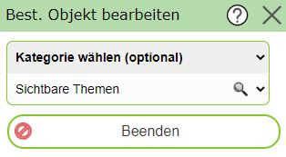
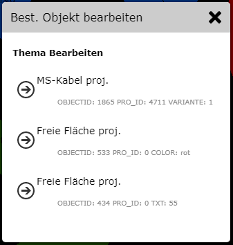
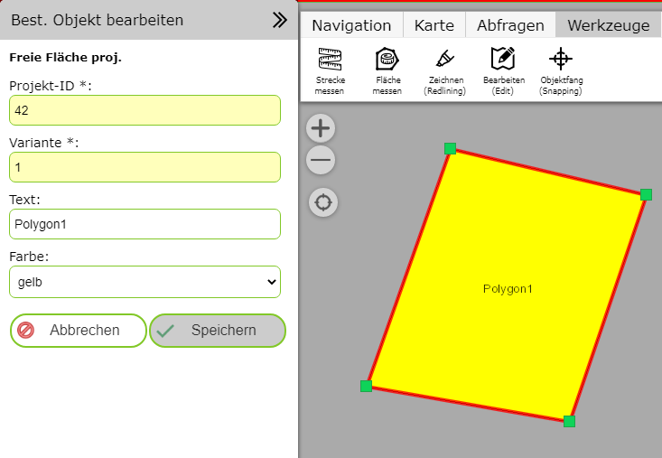

Bestehendes Objekt bearbeiten
=============================

Klickt man auf dieses Werkzeug, öffnet sich folgender Dialog:

Das Objekt, das bearbeitet werden sollte, muss zuerst ausgewählt (angeklickt) werden. Über diesen Dialog kann festgelegt werden,
um welchen Typ von Objekt es sich dabei handelt. Ist der Typ bekannt, kann auch die Option ``Sichtbare Themen`` verwendet 
werden. Der Kartenviewer versucht in diesem Fall an der Stelle, an der der Anwender in die Karte klickt, ein editierbares Objekt 
zu finden. Gelingt dies, wechselt die Ansicht sofort in die jeweilige Bearbeitungsmaske. Sind von einem Klick mehrere Objekte
betroffen, muss in einem Zwischenschritt noch entschieden werden, was bearbeitet werden sollte:

Wird das gewünschte Objekt gefunden, wird die Bearbeitungsmaske und eine bearbeitbarer Geometrie-Sketch in der Karte angezeigt:

In der Eingabemaske können die Sachdaten beliebig geändert werden. In der Karte kann der Sketch mit den Sketch-Tools bearbeitet werden:

* Bestehende Konten verschieben, löschen
* Zusätzlich Konten einfügen
* Weitere Abschnitte hinzufügen

(die Beschreibung der Sketch-Tools wird in einem eigenen Kapitel beschrieben)

Nach dem Ändern kann das Objekt mit ``Speichern`` übernommen werden. Mit ``Beenden`` kann die Bearbeitung jederzeit beendet/abgebrochen werden.
Danach kommt man wieder in die ``Bestehendes Objekt bearbeiten`` Maske und kann durch Anklicken weitere Objekte bearbeiten.

Mit dem ``Beenden`` Button oder durch Schließen des Werkzeugdialogs wird das (Sub) Werkzeug wieder beendet. 

