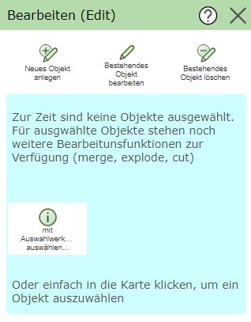

Bearbeiten (Edit)
=================

Mit diesem Werkzeug können Geo-Objekte in der Karte erfasst, geändert und gelöscht werden. Es können sowohl
die Geometrie als auch die Sachdaten bearbeitet werden. Welche Themen und Methoden bei der Bearbeitung möglich
sind, wird vom Kartenautor festgelegt.

Ruft man das Werkzeugzeug auf, wird den Edit Werkzeugdialog angezeigt. In diesem Dialog werden weiter Werkzeuge zum
Bearbeiten von Geo-Objekten angeführt:

Es gibt unterschiedliche Methoden, ein Objekt zu bearbeiten. Wenn die entsprechenden Geo-Objekte beispielsweise bereits 
über eine Abfrage ausgewählt wurden könne sie direkt hier bearbeite werden. Diese 'Abkürzungen' werden später noch
beschreiben. Zum Verständnis der Bearbeitungsmöglichkeiten wird hier zuerst auf die drei Standard-Methoden *Objekte anlegen*,
*Objekt bearbeiten* und *Objekte löschen* eingegangen. Die einzelnen Vorgänge könne über den entsprechenden 
Button im Werkzeugdialog gestartet werden.

.. toctree::
   :maxdepth: 2

   edit_create
   edit_update
   edit_delete