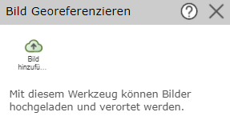
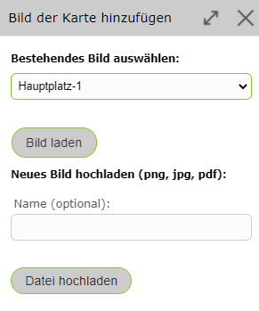
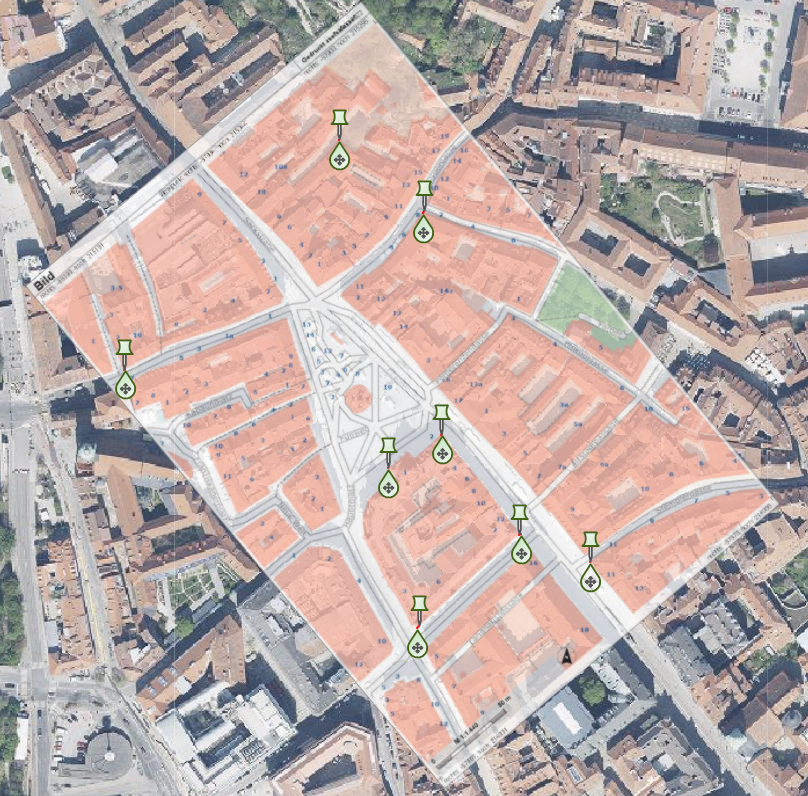
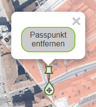
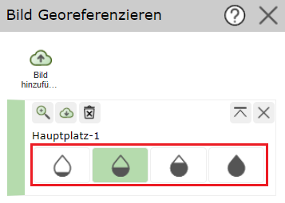
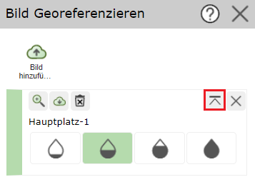
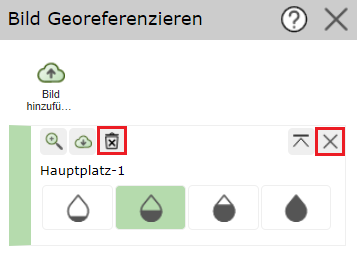
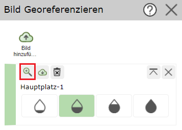
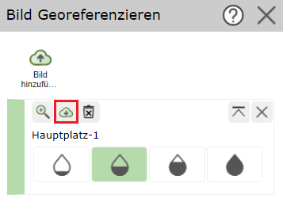
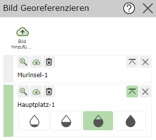

Bilder Georeferenzieren
=======================

Mit dem Werkzeug *Bild Georeferenzieren* können Bilder im png-, jpg- oder pdf-Format hochgeladen und verortet werden.

Bild hinzufügen
---------------

Dazu muss zuerst über *Bild hinzufügen* ein Bild hinzugefügt werden. 

Man kann entweder bereits bestehende Bilder verwenden, falls schon Bilder zuvor hochgeladen wurden, oder neue Bilder hochladen.
Hochgeladene Bilder werden für den Benutzer auf unbestimmte Zeit gespeichert.

Bild Georeferenzieren
---------------------

Um das hinzugefügte Bild zu georeferenzieren, muss das Bild aktiv gesetzt sein (grüner seitlicher Balken).

Mit einem einfachen Klick in die Karte wird ein Passpunkt gesetzt. Das *Stecknadel*-Symbol zeigt den Passpunkt am Bild und der Marker zeigt den Passpunkt in der Karte. Die Symbole können beliebig oft verschoben und somit angepasst werden. 

Klickt man auf eine Stecknadel, kann jener Passpunkt mit **Passpunkt entfernen** wieder gelöscht werden.

.. note:: Am besten gelingt die Georeferenzierung, wenn die Passpunkte am Rand des Bildes gesetzt werden. 
    Man kann zum Beispiel zu Beginn die markantesten Punkte des Bildes in der Mitte setzen, sich dann iterativ nach außen arbeiten und die inneren Passpunkte wieder entfernen.

Transparenz ändern
------------------

Mit den Wassertropfen auf der Seite kann die Transparenz des Bildes verändert werden. Das erleichtert das Erkennen markanter Punkte in der Karte bzw. im Bild.

Bildreihenfolge ändern
----------------------

Mit dem folgenden Button kann das dementsprechende Bild ganz nach oben verschoben werden. Das ist hilfreich, wenn mehrere Bilder auf einer Stelle geladen wurden.

Bilder löschen
--------------

Mit dem *X*-Symbol können Bilder aus der Karte gelöscht werden. Mit dem *Mistkübel*-Symbol wird das Bild endgültig für den Benutzer gelöscht.

Auf Bild zoomen
---------------

Mit dem *Lupen*-Symbol kann auf das dementsprechende Bild gezoomt werden.

Bild herunterladen
------------------

Mit dem *Download*-Symbol kann das Bild mit Worldfile im gewünschten Koordinatensystem als zip-Ordner heruntergeladen werden. Optional kann auch das Worldfile mit Passpunkten heruntergeladen werden. 
Die Passpunkte können anschließend erneut ins WebGIS geladen werden.

Bild aktiv setzen
-----------------

Klickt man auf den seitlichen Balken, kann man Bilder aktiv setzen. Die gesetzten Passpunkte beziehen sich immer auf das aktive Bild.

