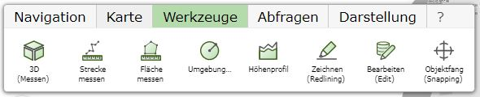

Allgemeine Werkzeuge
====================

Unter *Werkzeuge* befinden sich folgende Werkzeuge (abhängig von den Einstellungen des Kartenautors):

.. toctree::
   :maxdepth: 3

   measure-line.rst
   measure-area.rst
   circle.rst
   Redlining/index.rst