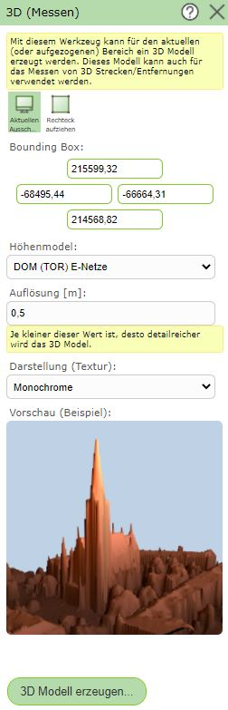

3D messen
=========

Mit diesem Werkzeug kann ein 3D-Modell erstellt werden, in welchem auch Messungen durchgeführt werden können. 

Nach Klicken auf das Werkzeug öffnet sich das Menü, in welchem mehrere Spezifikationen eingestellt werden können.

**Bounding Box**

Dafür muss zuerst der Bereich des 3D-Modells bestimmt werden. Dieser kann entweder über den aktuellen Ausschnitt oder über Aufziehen eines Rechteckes definiert werden. 
Alternativ können die Koordinaten auch händisch eingetragen werden.

**Höhenmodell**

Unter Höhenmodell kann das gewünschte Höhenmodell ausgewählt werden, auf dessen Basis das 3D-Modell erstellt wird.

**Auflösung**

Des weiteren muss die Auflösung des 3D-Modelles festgelegt werden.
Die bestmögliche Auflösung, welche von der Größe des Ausschnitts sowie vom Oberflächenmodell im Hintergrund abhängt, wird bereits im Feld vorgeschlagen. 
Wird die Auflösung zu fein gewählt, wird eine Warnung beim Erstellen des 3D-Modelles kommen.

.. note::
   Je größer die Bounding Box und je feiner die Auflösung ist, desto umfangreicher wird das 3D-Modell. 

**Darstellung (Textur)**

Für die Darstellung des 3D-Modells können unterschiedliche Texturen gewählt werden.
Die jeweilig gewählte Textur sieht man dann direkt in der Vorschau.

Mit ``3D Modell erzeugen ...`` wird zum ausgewähltem 3D-Modell gewechselt.

In diesem View gibt es folgende Navigationsmöglichkeiten:

* **verschieben:** Dazu muss mit der rechten Maustaste in das Modell geklickt und bei gedrückt gehaltener Maustaste das Modell verschoben werden. Durch das Loslassen der Maustaste wird der Vorgang beendet.

* **zoomen:** Dies kann mithilfe des Mausrades erfolgen. Das nach Vorne drehen des Mausrads verkleinert den Ausschnitt und umgekehrt.

* **drehen:** Dazu muss mit der linken Maustaste in das Modell geklickt und bei gedrückt gehaltener Maustaste das Modell verdreht werden. 

Rechts unten befindet sich eine Box mit den Lageinformationen zur Mausposition.

Durch einfaches Klicken in die Karte wird ein Stützpunkt gesetzt. Werden weitere Stützpunkte gesetzt, wird die Länge in 2D und 3D sowie die Höhendifferenz zwischen den jeweiligen Stützpunkten berechnet. 

Gelb hinterlegt ist die Summe der Längen sowie der summierte Höhenunterschied aller Stützpunkte ersichtlich.

Mit dem ``Undo`` Button kann der zuletzt gesetzte Stützpunkt entfernt werden. Durch einen Klick auf den ``Alle entfernen`` Button werden alle Stützpunkte entfernt.

Über das ``X`` rechts oben kann das 3D-Modell wieder geschlossen werden.