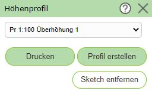
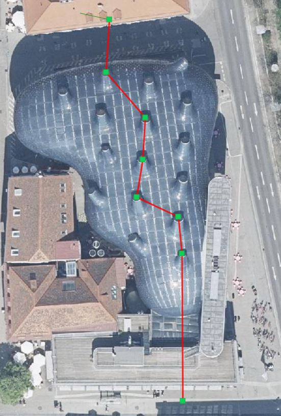
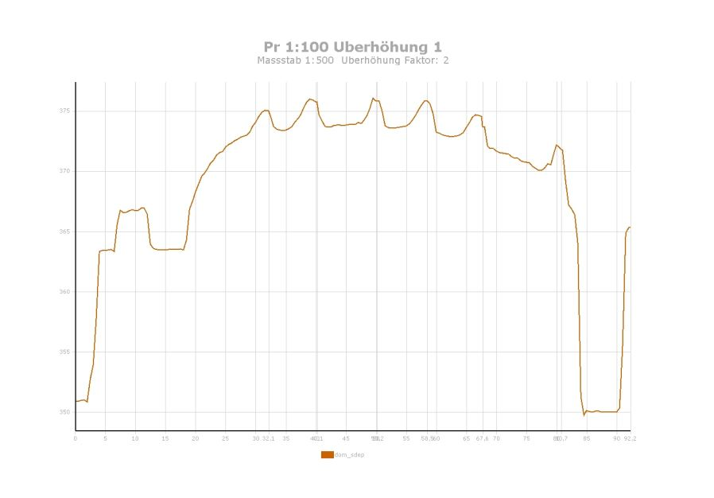

Höhenprofil
===========

Mit diesem Werkzeug kann ein Höhenprofil entlang einer gezeichneten (Poly)Linie erstellt werden.
Im Werkzeugdialog muss bestimmt werden, für welchen Fall (Maßstab/Überhöhung) das Profil erstellt werden sollten.

.. note::
   Der Maßstab bestimmt dabei in der Regel, wie viele Zwischenpunkte abgefragt werden sollen. Wählt man
   beispielsweise einen sehr großen Maßstab für einen sehr langen Linienzug, kann die Erstellung des Profils sehr lange
   dauern, weil dann sehr viele Zwischenpunkte abgefragt werden. Im schlimmsten Fall ist die Abfrage gar nicht möglich.

In der kann jetzt eine Linie mit mehreren Zwischenpunkten erstellt werden.

Klickt man danach im Werkzeugdialog auf Profil erstellen, wird nach kurzer Berechnungszeit das Höhenprofil
angezeigt:

.. note:: 
   Ist das Profile zu "ungenau" (hat zu wenige Zwischenpunkte) kann der Profiltype geändert und das Profil neu erstellt werden.

.. note::
   Das im Viewer angezeigte Höhenprofil ist interaktiv. Bewegt man die Maus auf einen der *Höhenpunkte*, wird die 
   Höhe als Tooltip angezeigt. Gleichzeitig wird an der entsprechenden Stelle in der Karte auf der gezeichneten 
   Profillinie ein Marker dargestellt.

Über den *Drucken* Button im Werkzeugdialog kann das Profil auch als PDF ausgegeben werden.
Dazu erscheint noch einmal ein Dialog, in dem der Zielmaßstab und die genaue Überhöhung des Profils angegeben 
werden kann:

Nach erfolgreichem Erstellen der PDF Datei erscheint eine Vorschau im Druckaufträge Dialog und das Höhenprofil kann
herunter geladen werden:

