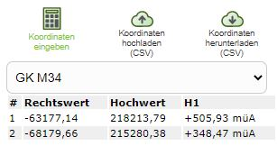

Koordinaten
===========

Koordinaten eingeben und abfragen
---------------------------------

Mit dem *Koordinaten Abfragen* Werkzeug, können einerseits Koordinaten durch Klicken in die Karte abgefragt,
als auch Koordinaten eingegeben und angezeigt werden.

.. note::
   **Tip:** Das Werkzeug kann nicht nur über den Werkzeugkasten aufgerufen werden, sondern öffnet sich auch
   wenn man auf die Mitlaufenden Koordinaten im Kartenviewer klickt:

   .. img/coords1.png

Möchte man zu einer einer bestimmte Koordinate springen, erfolgt dies über das Sub-Werkzeug *Koordinaten eingeben*.
Zuvor empfiehlt es sich auch einmal die *Eingabe Tipps* aufzuklappen, wo unterschiedliche Eingabemöglichkeiten
für geographische und projizierte Koordinaten gezeigt werden.

Koordinaten werden in folgendem Dialog eingegeben:

.. image:: img/coords2.png

In der Auswahlliste muss zuerst ein Koordinatensystem ausgewählt und danach in den Eingabefeldern Rechts- und 
Hochwert eingetragen werden. Durch bestätigen des Dialog mit *Koordinate anzeigen* wechselt der Kartenausschnitt
zur gewünschten Position und es wird ein Marker angezeigt.

.. note::
   **Tip:** Will man nur zu einem Punkt mit gekannten geographischen Koordinaten springen, besteht auch die
   Möglichkeit, die Koordinaten in die Schnellsuche einzutragen (siehe Abschnitt *Suchen und Abfragen*)

Marker können ebenfalls durch einen Klick in die Karte erzeugt werden. Wird der Kartenviewer am Desktop
verwendet, werden die Koordinaten in einer Listenansicht im Werkzeugdialog angezeigt:

In der Auswahlliste über der Koordinatenliste kann ein Koordinatensystem gewählt werden. In dem hier
gewählten Koordinatensystem werden die Koordinaten in der Liste angezeigt.

Mit dem Button *Marker entferenen* verschwinden alle Marker aus der Karte und Einträge aus der Liste.

Koordinaten herunterladen
-------------------------

Die Liste der Koordinaten kann als CSV Datei herunter geladen werden. Dazu dient das Sub-Werkzeug
*Koordinaten herunterladen (CSV)*. Herunter geladen werden die Koordinaten in dem Koordinatensystem,
das aktuell für die Koordinatenliste ausgewählt ist. Es wird also die Liste so herunter geladen, wie sie im 
Werkzeugdialog angezeigt wird.

Bei CSV handelt es sich um eine Text Datei, die in jedem Texteditor geöffnet werden kann. Auch 
Tabellenkalkulationsprogramme wie MS-Excel können mit diesen Datei in der Regel umgehen:

Koordinaten hochladen
---------------------

Eine Koordinatenliste kann ebenfalls hochgeladen werden. Die Daten müssen hier ebenfalls in einer CSV
Datei vorliegen (Trennzeichen muss ein Strickpunkt sein, als Komma wird Beistrich oder Punkt akzeptiert):

Beim Hochladen muss in einem Dialog zuerst das Koordinatensystem angegeben werden, in dem die Koordinaten vorliegen.
Danach kann die Datei hochgeladen werden.

Ist der Upload erfolgreich, werden die Koordinaten durch Marker in der Karte markiert und als Koordinatenliste 
im Werkzeugdialog angezeigt.

Koordinaten projizieren (umwandeln)
-----------------------------------

Mit den oben gezeigten Methoden ist es auch möglich, Koordinatenlisten von einem Koordinatensystem in ein anderes 
zu überzuführen. Voraussetzung ist dabei, dass die gewünschten Koordinatensysteme vom Kartenviewer angeboten werden.

Die Vorgehensweise ist dabei folgende:

* Koordinatenliste als CSV hochladen

* In der Karte kontrolliren, ob alle Koordinaten korrekt hochgeladen wurden. Falls die Lage dort nicht richtig ist, wurde beim Hochladen wahrscheinlich ein falsches Koordinatensystem angegeben

* Im Werkzeugdialog für die Koordinatenliste das gewünschte Ziel-Koordinatensystem auswählen

* Koordinaten im CSV Format herunterladen

