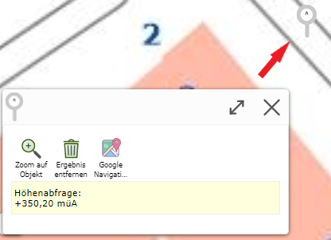

Höhenmodell abfragen
====================

Ist das *Höhenmodell abfragen* Werkzeug gewählt, können durch einfaches Klicken in die Karte Höhen abgefragt werden.

.. note:: Es werden immer nur einzelne Messungen durchgeführt und das Ergebnis wird direkt links unten am Bildschirm (Desktop-Version) angezeigt.
    Wenn die abgefragten Höhen gespeichert oder heruntergeladen werden sollen, muss das *Koordinaten* Abfrage Werkzeug verwendet werden. 

* **Zoom auf Objekt:** Es wird auf das aktuelle Objekt gezoomt.

* **Ergebnis entfernen:** Aktuelle Ergebnis wird entfernt.

* **Google Navigation:** Weiterleitung zu *Google Maps*, wo man eine Route berechnen und starten kann.

Durch Klicken auf bereits gesetzte Marker wird das Ergebnis erneut angezeigt.

Mittels dem ``Marker entfernen`` Button können alle gesetzten Marker wieder entfernt werden.
