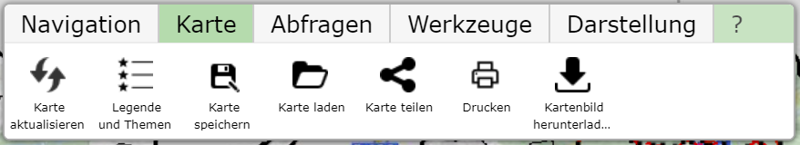

Karten Werkzeuge
================

Unter *Karte* befinden sich folgende Werkzeuge (abhängig von den Einstellungen des Kartenautors):

.. toctree::
   :maxdepth: 3

   refresh.rst
   legend.rst
   save.rst
   load.rst
   share.rst
   liveshare/index.rst
   print.rst
   downloadmapimage.rst

