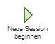
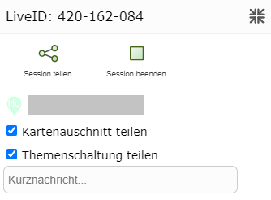
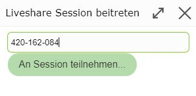
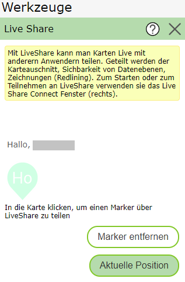

Ablauf
======

Klickt man auf das *Live Share* Werkzeug, öffnet sich folgendes Fenster:

Neue Session beginnen
---------------------

Zuerst muss der Session Eigentümer eine neue Session beginnen.  

Nach dem Beginnen der Session öffnet sich ein Fenster, welches Möglichkeiten zum Teilen der Session bietet.

Außerdem erscheint rechts unten ein Infofenster zur aktuellen Liveshare Session.

Session teilen
--------------

Es gibt verschiedene Möglichkeiten die Liveshare Session zu teilen:

* **Liveshare Session Id:** Falls man über das Liveshare Werkzeug in die Session einsteigen will. (Dazu braucht man allerdings einen Zugang zu einer Webgis Karte, in welcher das Liveshare Werkzeug verfügbar ist. Das braucht man bei den anderen Zugangsmöglichkeiten nicht.)

* **Email:** Öffnet das Emailprogramm mit welchem man dann den Zutrittslink verschicken kann.

* **Kopieren (Zwischenablage):** Der Zugangslink wird in die Zwischenablage kopiert.

* **QR-Code:** Erstellt einen QR-Code, welchem der Zugangslink hinterlegt ist. Somit ist ein einfacher Zugang mit dem Handy möglich.

* **Facebook:** Weiterleitung an Facebook.

* **Twitter:** Weiterleitung an Twitter.

an Session teilnehmen
---------------------

Öffnet der Teilnehmer eine der beliebigen Varianten, wird er gefragt ob er der Liveshare Session beitreten will:

Der Session Eigentümer wird dann aufgefordert jeden neuen Teilnehmer zu bestätigen:

aktive Liveshare Session
------------------------

Was mit dem Liveshare Werkzeug alles gemacht werden kann, wurde im vorherigen Abschnitt schon näher erläutert. Hier werden die neuen Möglichkeiten beschrieben. 

* **Kartenausschnitt/Themenschaltung teilen**

Ist *Kartenausschnitt teilen* ausgewählt, wird in allen Sessions derselbe Kartenausschnitt angezeigt.
Ist *Themenschaltung teilen* ausgewählt, werden in allen Sessions dieselben Themen angezeigt.

* **Marker setzen**

Jeder Session Teilnehmer kann seinen eigenen Marker setzen. Dazu muss er einfach in die Karte klicken.
Über ``Aktuelle Position`` kann der Marker auch auf die aktuelle Position gesetzt werden. 
Mit ``Marker entfernen`` kann der Marker wieder entfernt werden.

Session beenden
---------------

Über *Session beenden* kann der Eigentümer die Liveshare Session beenden.

Session verlassen
-----------------

Mit *Session verlassen* können Teilnehmer aus der Liveshare Session aussteigen. Die Session ist dadurch nicht beendet.

