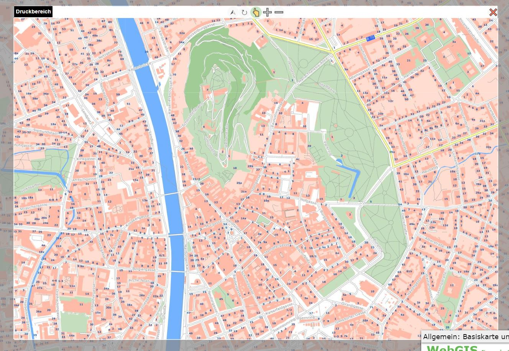
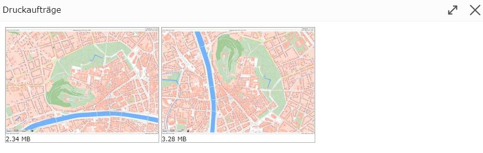

Drucken
=======

Mit diesem Werkzeug können Kartenausschnitte maßstabsgetreu ausgedruckt bzw. als PDF Dateien heruntergeladen werden.
Die Karte wird im PDF zusätzlich einem speziellen Layout eingebettet, das Zusatzinformationen wie Nordpfeil, 
Legende, Copyright Hinweise, Koordinatenmarken usw. enthalten kann.

Über den Werkzeugdialog sind diverse Einstellunge zum Ausdruck durchführbar. Die möglichen Werte dieser Einstellungen
werden vom Kartenautor definiert: 

* **Layout:** Es gibt unterschiedliche Layouts, die vom Kartenautor definiert werden können. Das endgültige Layout ist erst später im Ausdruck ersichtlich und enthält je nach Definition Überschrift, Nordpfeil, Rechtliche Hinweise usw.
* **Format:** Gibt (Papier)Größe und Ausrichtung der gedruckten Karte an.
* **Maßstab:** Der Ausdruck kann nur in vordefinierten Maßstäben erfolgen.
* **Qualität:** Definiert die Qualität der Karte. Je höher die DPI Zahl, desto höher ist die Qualität des Ausdrucks. Zu beachten ist dabei allerdings auch, dass damit auch die Größe der PDF Datei zunimmt.

Bei ausgewähltem Druckwerkzeug ändert sich auch die Kartenansicht. Hier wird eine "Linse" über die Karte gelegt,
die den Bereich markiert, der später gedruckt wird.

Die Karte kann mit der Maus so verschoben werden, dass der gewünschte Ausschnitt in die "Linse" passt. Ändert man das 
Drucklayout oder das Format/Ausrichtung, ändert sich automatisch auch die "Linse".

.. note:: 
   Mit dem Druckwerkzeug kann die Karte nur mehr verschoben werden. Ein Ändern des Maßstabes (Zoomen) ist mit den 
   üblichen Methoden nicht mehr möglich. Der Maßstab kann über die Auswahlliste im Werkzeugdialog (oder den Linsen-Buttons,
   siehe unten) eingestellt werden.
   Der Grund dafür ist hier, dass die Maßstäbe für die Bildschirmanzeige nicht zwingend mit den möglichen Druckmaßstäben
   übereinstimmen.

Über der "Linse", die den Druckbereich markiert, befinden sich einige Buttons, die die Bedienung beeinflussen.
Die Beschreibung dieser Buttons erfolgt hier von rechts nach links:

   
* **Schließen (X):** Mit diesem Button kann man die "Linse" schließen und das Druckwerkzeug wieder verlassen.
* **Ausschnitt Vergrößern (-):** Mit diesem Button wird der Druckmaßstab verkleinert (dient als Vereinfachung, damit nicht zwingend die Druckmaßstabs-Auswahlliste benutzt werden muss).
* **Ausschnitt Verkleinern (+):** Mit diesem Button wird der Druckmaßstab vergrößert.
* **Verschieben (Hand-Symbol):** Ist dieses Werkzeug ausgewählt, kann der Kartenbereich verschoben werden.
* **Drehen (Rotations-Symbol):** Ist dieses Werkzeug ausgewählt, kann die Linse mit gedrückter Maustaste gedreht werden. Dazu die linke Maustaste gedrückt halten und die Maus um das Zentrum der Karte bewegen.
* **Norden (Pfeil-Symbol):** Klickt man auf diesen Button, wird die "Linse" wieder genordet.

.. note:: 
   Dreht man die Linse, ist die gedruckte Karte nicht mehr genordet. Der obere Rand der gedruckten Karte entspricht 
   dem Rand der Linse mit dem Text "Druckbereich".

.. note::
   **Hinweis zu Maßstabsgrenzen:** Einige Themen werden in der Karte nur in bestimmten Maßstäben angezeigt.
   Zur Bestimmung des Bereiches über die "Linse" kann die Karte allerdings nicht in diesem Maßstab angezeigt werden,
   da Bildschirm und Papiergröße in der Regel nicht ident sind. Außerdem können sich Druckmaßstabe und 
   Kartenmaßstäbe für den Bildschirm unterscheiden. In der Regel wird für die Darstellung der Linse
   die Karte am Bildschirm in einem kleineren Maßstab darstellt. Daher sind in dieser Ansicht eventuell nicht
   alle Themen sichtbar, die später aber trotzdem im Ausdruck landen.
   **Achtung:** Die Darstellung wird hier so gewählt, dass die Definition des Ausschnittes möglich ist.
   Der Inhalt im Ausdruck ist vom jeweiligen Druckmaßstab abhängig.

Wurde der Ausschnitt über die Linse korrekt eingestellt, kann der Ausdruck mit dem ``Drucken`` Button im Werkzeugdialog
gestartet werden. Damit erscheint zuerst ein Dialog, in dem noch einige Angaben zum Ausdruck gemacht werden können (welche
Angaben hier gemacht werden können, ist vom jeweiligen Drucklayout abhängig).

Wird der Druckauftrag gestartet und erfolgreich durchgeführt, öffnet sich die Druckvorschau mit allen in der aktuellen
Session erzeugten Karten:

Von hier können die Karten durch *anklicken* heruntergeladen und gedruckt werden.

.. note::
   Die Druckvorschau kann auch nachträglich über den entsprechenden Button im *Drucken* Werkzeugdialog geöffnet werden.
   Dort werden die Ausdrucke aus anderen Werkeugen (zB Höhenprofil) angezeigt.

.. note::
   Die Druckvorschau bleibt nur innerhalb der Session erhalten. Nach dem Neustarten des Viewers verschwinden die 
   Karten in der Vorschau. Es kann auch passieren, dass die erstellten PDF Dokumente nach einer gewissen Zeit am
   Server wieder gelöscht werden. PDF Dokumente sollten idealerweise gleich nach dem Erstellen lokal gespeichert 
   oder gedruckt werden. 

 

