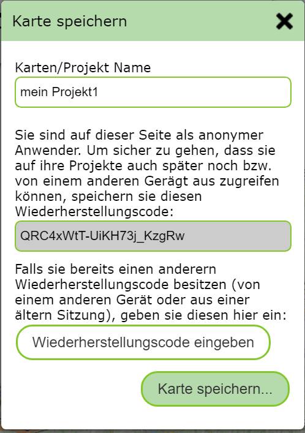

Karte speichern
===============

Mit diesem Werkzeug kann eine Karte gespeichert und zu einem späteren Zeitpunkt wieder geöffnet werden.
Gespeichert werden dabei folgende Kartenmarkmale:

* Kartenausschnitt 

* Sichtbare Themenebenen

* Zeichnungen, die mit dem *Zeichnen (Redlining)* Werkzeug erstellt wurden.

.. note::
   Das Speichren Werkzeug garantiert nicht, dass die Karte 1:1 auf ewig wieder abrufbar ist.
   Da sich die zugrundeliegenden Kartendienste von Zeit zu Zeit ändern können (Themenebenen werden 
   hinzugefügt, entfernt oder umbenannt, die Darstellung wird geändert, usw.) kann die Karte
   einem späteren Öffnen theoretisch verändert erscheinen. Wollen sie ein Kartenbild unveränderlich
   speichern, kann auch einen Ausdruck als PDF erfolgen (siehe Werkzeug *Drucken*)

Klickt man auf das Werkzeug, öffnet sich ein Dialog, in dem für die Karte ein Name vergeben werden kann.
Mit diesem Namen kann die Karte später wieder geladen werden. 

.. note::
   Wurde der Name bereits einmal verwendet, wird die *alte* Karte, ohne nachfrage überschrieben und durch
   die aktuelle ersetzt.

.. note::
   Die gespeicherten Karten sind nur für den Benutzer sichtbar, der sie gespeichert hat. Die Namen für
   die gespeicherten Karten müssen auch nur pro Benutzer eindeutig sein.
   

Karte speichern als anonymer Benutzer
-------------------------------------

Das Speichern der Karte setzt voraus, dass ein Anwender in einer späteren Sitzung wiedererkannt werden muss, 
um die Zeichnungen wieder öffnen zu können. Für Intranet Anwendungen erfolgt das in der Regel automatisch über 
die Anmeldung im Firmennetzwerk. Beim anonymen Zugriff aus dem Internet erscheint beim Speichern noch ein 
Hinweise, um Sitzungen zu einem späteren Zeitpunkt wieder herzustellen. Der Hinweis lautet etwa folgendermaßen:

Wichtig ist hier, das der Wiederherstellungscode nach dem ersten Verwenden irgendwo gespeichert wird.
(Beispielsweise kann man den Wiederherstellungscode aus dem Textfeld kopieren und in eine Textdatei oder E-mail
kopieren und sie so archivieren)
Der Wiederherstellungscode wird grundsätzlich im Browser gespeichert, allerdings kann dieser durch das 
Löschen des Browser Caches auch verloren gehen. In diesem Fall kann man einen archivierten Wiederherstellungscode
hier (und später auch im *Karte Laden* Dialog eingeben, um seine Karten wieder abrufen zu können.

.. note::
   Der Wiederherstellungscode ist auch notwendig, wenn der Browser oder das Endgerät (Destkop, Tablett, Handy)
   gewechselt wird.

.. note::
   Wenn sie den Wiederherstellungscode anderen Benutzern zur Verfügung stellen, können diese alle ihre
   Karten öffnen und theoretisch auch überschreiben. Geben sie den Wiederherstellungscode also nicht
   weiter und verwenden sie zum *Teilen* von Karten eher das *Karte Teilen* Werkzeug.