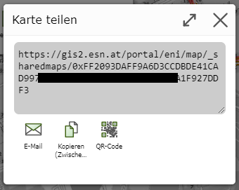

Karte teilen
============

Mit dem *Karte speichern* und *Karte laden* Werkzeug können Karten immer nur vom selben Benutzer
verwaltet werden. Möchte man eine Karte mit anderen Benutzern teilen, hilft diese Werkzeug.

Geteilt werden:

* Kartenausschnitt

* Sichtbare Themenebenen

* Mit dem *Zeichnen (Redlining)* Werkzeug erstellte Zeichnungen

Nach dem Öffnen des Werkzeugs erscheint ein Dialog in dem Angeben werden kann, wie lange das Teilen der Karte
gültig sein sollte. Das Teilen von Karten sollte nur temporär sind und dem Zweck dienen, Karten dauerhaft 
zu speichern. Außerdem kann, wie auch schon beim *Karte speichern* Werkzeug erklärt, nicht garantiert werden,
dass die Karte auch noch nach längerer Zeit gleich erscheint. 

Wählen sie daher im ersten Dialog aus, wie lange (1 Tage, 1 Woche, 1 Monat) die geteilte Karte 
gültig sein sollte.

Im nächsten Schritt erscheint ein Dialog mit dem erzeugten Link:

Er erzeugte Link kann über die angeboten Werkezuge 

* Per E-Mail verschickt (E-Mail Programm öffnet sich)

* In die Zwischenablage kopiert

* als QR Code angezeigt werden

QR Codes sind praktisch, wenn das Endgerät ein Handy ist. Diese können QR Code in der Regel mit der Kamera 
scannen und öffnen danach automatisch den hinterlegten Link. Man so beispielsweise einfach ein Karte, die bereits
am Desktop geöffnet ist, auf eine mobiles Gerät übertragen.

