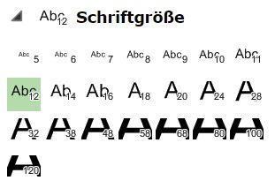
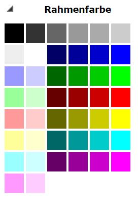

Themen beschriften
==================

Mit diesem Werkzeug können Themen noch zusätzlich beschriftet werden.

.. image:: img/labeling1.png

Dafür muss man zuerst das Thema, welches beschriftet werden soll, auswählen.
Je nach Thema werden dann die möglichen Beschriftungsfelder angeboten. 
Welche Felder als Beschriftung verwendet werden können, wird von Kartenautor festgelegt. ????????

Die Beschriftungsmethode legt fest, wie oft ein Objekt beschriftet werden soll. 

* **Alles:** Jedes Objekt wird beschriftet.

* **pro Name 1x:** Wenn mehrere Objekte dieselbe Beschriftung haben, wird nur ein Objekt davon beschriftet.

* **pro Objekt 1x:** Jedes Objekt wird nur einmal beschriftet. Dadurch werden insgesamt weniger Beschriftungen angezeigt, ist bei Leitungen oder langen Straßen jedoch nicht zu empfehlen.

Des weiteren kann noch der Style definiert werden. Dazu stehen folgende Einstellungsmöglichkeiten zur Verfügung:

Mit ``Übernehmen`` wird die gewählte Beschriftung gesetzt und kann über ``Entfernen`` wieder entfernt werden.

Es können beliebig viele weitere Beschriftungen gesetzt werden, jedoch kann immer nur die zuletzt gesetzte Beschriftung wieder entfernt werden.