Stützpunkt(e) konstruieren
==========================

Neue Stützpunkte können auch über folgende Methoden konstruiert werden. Zum Menü kommt man, indem man mit der rechten Maustaste in die Karte oder auf einen Vertex klickt.

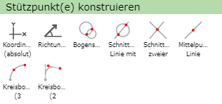

Mit einem erneuten rechten Mausklick kann der Konstruktionsmodus jederzeit abgebrochen werden.

Koordinaten
-----------

Mit der Option *Koordinaten (absolut)* kann der nächste Vertex mit absoluten Koordinaten festgelegt werden. 
Wählt man diese Funktion öffnet sich folgendes Fenster:

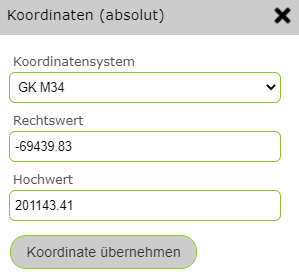

Hier kann zuerst das dementsprechende Koordinatensystem ausgewählt und danach der Rechtswert und Hochwert eingetragen werden. 
Im Feld sind bereits die Koordinaten der Stelle, an welcher der rechte Mausklick getätigt wurden, im Koordinatensystem der Karte eingetragen.
Mit ``Koordinate übernehmen`` wird der neue Vertex gesetzt.

Richtung/Entfernung
-------------------

Mit *Richtung/Entfernung* kann der nächste Vertex über die Richtung und die Entfernung im Bezug auf den vorigen Vertex bestimmt werden.

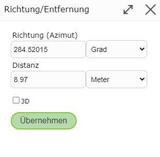

Die bereits in den Feldern eingetragenen Werte bezieht sich auf die Position des rechten Mausklicks und können manuell beliebig geändert werden.

Bogenschnitt
------------

Mit einem *Bogenschnitt* können 2 Hilfskreise mit beliebigen Radius gezeichnet werden und eignet sich daher vor allem für Anwendungsfälle, wo 2 Distanzen bekannt sind. Dazu muss zuerst in die Karte geklickt werden um den Mittelpunkt des ersten Kreises zu definieren. Dann kann entweder der Kreis mit der Maus aufgezogen werden oder über einen Klick mit der rechten Maustaste der Radius exakt eingegeben werden. 
Die Erstellung des zweiten Kreises erfolgt analog. Anschließend werden die beiden Schnittpunkte der Kreise rot markiert und sind zum Setzen des neuen Vertex auswählbar. 

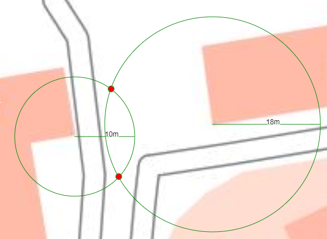

Schnittpunkt Linie mit Kreis 
----------------------------

Mit *Schnittpunkt Linie mit Kreis* kann der neue Vertex mit Hilfe einer Linie und eines Kreises erstellt werden. Das ist vor allem für Fälle, wo eine Richtung und eine Distanz bekannt sind, hilfreich. Dafür muss zuerst  die Linie mit 2 Stützpunkten gezeichnet werden. Anschließend wird der Kreis konstruiert, indem zuerst für den Mittelpunkt in die Karte geklickt wird und dann entweder der Kreis mit der Maus aufgezogen wird oder bei fix bekanntem Radius der Wert auch über die rechte Maustaste direkt eingegeben werden kann.
Schlussendlich kann dann der neue Vertex aus den in der Regel beiden entstandenen Schnittpunkten gewählt werden. 

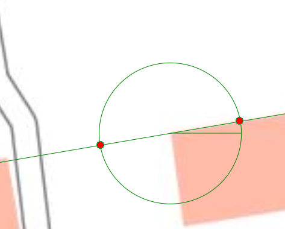

Schnittpunkt zweier Linien
--------------------------

Mit *Schnittpunkt zweier Linien* können zwei Hilfslinien gezeichnet werden. Der dadruch enstehende Schnittpunkt kann dann als neuer Vertex ausgewählt werden.

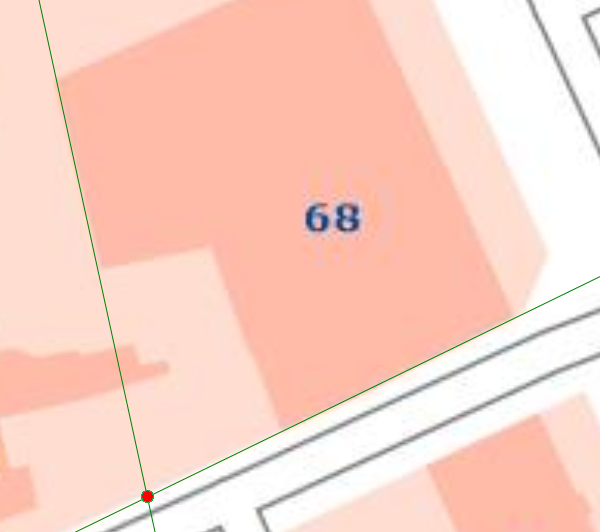

Mittelpunkt Linie
-----------------

Mit *Mittelpunkt Linie* kann ein Vertex auf den Mittelpunkt einer neu konstruierten Linie gezeichnet werden. Dafür müssen lediglich Start- und Endpunkt der Hilfslinie gezeichnet werden. Der dadruch entstandene Mittelpunkt ist dann als Vertex auswählbar.

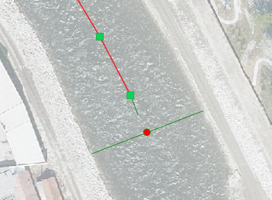

Kreisbogen (3 Punkte)
---------------------

*Kreisbogen (3 Punkte)* ermöglicht das Erstellen eines Kreisbogens mit 3 Punkten, wofür die folgenden 3 Schritte notwendig sind.

1. Setzen des Startpunktes des Kreisbogens
2. Setzen des Endpunktes des Kreisbogens
3. Setzen des 3. Punktes, welcher die Größe des Kreisbogens bestimmt

Dadurch entsteht ein Kreis, an welchem der gewünschte Kreisbogen (blau oder rot) gewählt werden muss. 

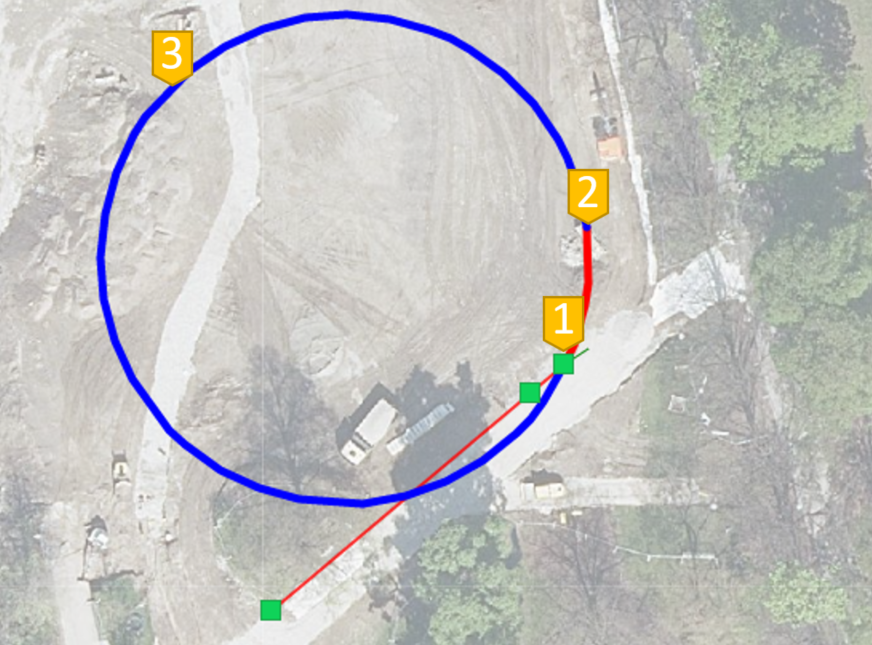

Der erstellte Kreisbogen (in diesem Fall der rote Teil) besteht dann aus mehreren Segmenten.

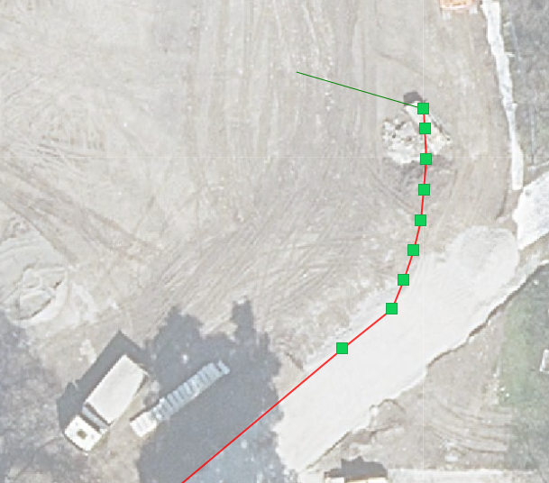

Kreisbogen (2 Tangenten)
------------------------

Bei der Funktion *Kreisbogen (2 Tangenten)* kann ein Kreisbogen mit 2 Tangenten definiert werden. Die erste Tangente stellt die Verlängerung des zuletzt gesetzten Liniensegmentes dar. Deshalb muss für dieses Tool schon ein Liniensegment vorhanden sein. 
Die zweite Tangente kann dann über das Setzen von 2 Punkten platziert werden, wobei der 2. Punkt dann auch dem Ende des neuen Segmentes entspricht. 

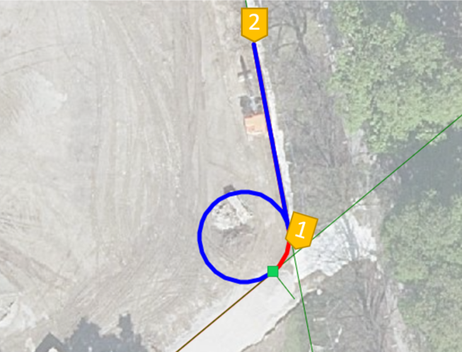

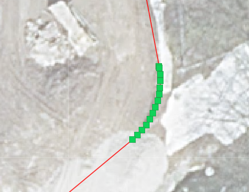

Kreis konstruieren
------------------

Um einen Kreis im Flächenwerkzeug zu konstruieren, muss man zuerst den Mittelpunkt setzen. Dann kann man im Menü über die rechte Maustaste *Kreis konstruieren* auswählen. Damit lässt sich ein Kreis aufziehen beziehungsweise über erneuten Mausklick eine fixe Distanz als Radius des Kreises eingeben. 

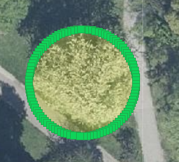

Rechteck konstruieren
---------------------

Ähnlich zum Kreis kann auch ein Rechteck konstruiert werden, indem nach dem Setzen des ersten Eckpunktes über rechte Maustaste *Rechteck konstruieren* ausgewählt wird. Damit kann dann ein Rechteck aufgezogen oder über rechte Maustaste Länge und Breite eingegeben werden.

Das erstellte Rechteck kann danach noch gedreht oder verschoben werden.