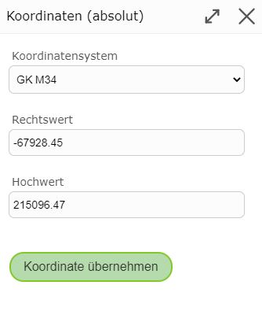

Koordinaten
===========

Mit der Option *Koordinaten (absolut)* kann der nächste Vertex mit absoluten Koordinaten festgelegt werden. 
Wählt man diese Funktion öffnet sich folgendes Fenster:

Hier kann zuerst das dementsprechende Koordinatensystem ausgewählt werden und danach der Rechtswert und Hochwert eingetragen werden. 
Im Feld sind bereits die Koordinaten der Stelle, an welcher der rechte Mausklick getätigt wurden, im Koordinatensystem der Karte eingetragen.
Mit ``Koordinate übernehmen`` wird der neue Vertex gesetzt.

