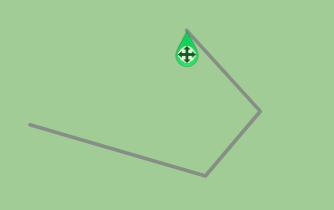
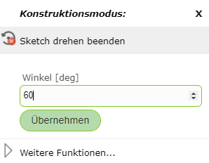
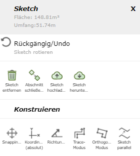

Sketch/Entwurfswerkzeuge
========================

Beim Zeichnen eines Sketches (zB beim Redlining, Editieren, Höhenprofil erstellen, ...) stehen mehrere Optionen zur Verfügung, die je nach Anwendung sehr hilfreich sein können.

Dazu muss während des Zeichnens mit der rechten Maustaste auf den Sketch oder in die Karte geklickt werden. Je nach Typ des Sketches (Linie, Polygon) werden folgende Optionen angeboten:

.. image:: img/sketch1.png

.. toctree::
   :maxdepth: 2

   construct
   presentation

.. note::
   Auf (mobilen) Geräten mit Touch Bedienung funktioniert der Klick in der Karte über das *Click Bubble* Werkzeug (siehe Abschnitt *Click Bubble* unter Werkzeuge).
   Der Vorteil der *Click Bubble* ist die Vermeidung von unabsichtlichen Klicks beim Navigieren und die höhere Präzision beim Klicken.

Rückgängig/Undo
---------------

Mit ``Rückgängig/Undo`` können die letzten Befehle, welche unter *Rückgängig/Undo* in grau angezeigt werden, rückgängig gemacht werden.

.. note:: Es gibt kein *Redo*.

Vertex Bearbeiten
-----------------

Vertices nennt man die sogenannten Stützpunkte der Linie, welche über verschiedene Arten nachträglich noch bearbeitbar sind.

* **Vertex verschieben:** Auf den Vertex klicken und mit gedrückter Maustaste den Vertex beliebig verschieben.

* **Vertex hinzufügen:** Dafür gibt es mehrere Möglichkeiten: in die Karte klicken, über *Richtung/Entfernung* (siehe unten) oder über *Koordinaten (absolut)* (siehe Konstruieren).

* **Vertex auf bestehender Linie hinzufügen:** Rechte Maustaste auf die Linie und dann *Vertex hinzufügen* wählen.

* **Vertex entfernen:** Rechte Maustaste auf den Vertex und dann *Vertex entfernen* wählen. 

* **Vertex fixieren/anschließen:** Rechte Maustaste auf den Vertex und dann *Vertex fixieren/anschließen* wählen. Diese Vertices bleiben dann beim Verschieben und Versetzen fixiert und sind als blaue größere Punkte erkennbar. Mit rechte Maustaste und dann *Fixierung aufheben* kann die Fixierung des Vertex wieder aufgehoben werden.

Sketch verschieben
------------------

Wenn man mit der rechten Maustaste auf einen Vertex des Sketches klickt, kann man den gesamten Sketch mit *Sketch verschieben* verschieben.
Es erscheint dann ein Symbol, mit welchem man dann den Sketch mit gedrückter Maustaste verschieben kann.

Sketch drehen
-------------

Bei *Sketch drehen* gibt es zwei Optionen: Entweder man setzt den rechten Mausklick auf einen Vertex oder auf eine Kante des Sketches.

* **Vertex:** Dabei fallt die Bezugsrichtung des Winkels auf die Koordinatenachse in Richtung Osten und der gewählte Vertex wird zum Drehpunkt. Damit kann der Sketch um einen Absolutwert gedreht werden.

   .. image:: img/sketch9.png

* **Kante:** Dabei wird die gewählte Kante der Nullrichtung nach Osten zugeordnet. Somit kann der Sketch anhand der Kante gedreht werden.

   .. image:: img/sketch8.png

Über einen rechten Mausklick in die Karte kann auch direkt ein Winkelwert in Grad eingegeben werden.

Über *Weitere Funktionen* erscheint folgendes Menü, welches weitere Funktionen ermöglicht.

Sketch entfernen
----------------

Mit ``Sketch entfernen`` werden die gezeichneten Sketches entfernt. Falls dieser Befehl unabsichtlich ausgeführt wurde, können die Sketches mittels ``Rückgängig/Undo`` wiederhergestellt werden.
In den meisten Werkzeugen lässt sich der Sketch auch seitlich links im Menü über den ``Sketch entfernen`` Button entfernen.

Abschnitt schließen/neuen beginnen
----------------------------------

Mit ``Abschnitt schließen/neuen beginnen`` wird der aktuelle Sketch abgeschlossen und ein neuer Sketch kann begonnen werden.
Somit kann man mehrere Linien/Polygone zeichnen.

Vertexreihenfolge umkehren
--------------------------

Mit Vertexreihenfolge umkehren kann bei einem Linien Sketch der Endpunkt mit dem Startpunkt umgekehrt werden. Es kann dadurch am anderen Ende der Linie weitergezeichnet werden.

Richtung/Entfernung
-------------------

Mit *Richtung/Entfernung* kann der nächste Vertex über die Richtung und die Entfernung im Bezug auf den vorigen Vertex bestimmt werden.

.. image:: img/sketch3.png

Die bereits in den Feldern eingetragenen Werte bezieht sich auf die Position des rechten Mausklicks und können manuell beliebig geändert werden.
