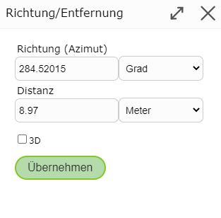

Sketch/Entwurfswerkzeuge
========================

Beim Zeichnen eines Sketches (zB beim Redlining, Editieren, Höhenprofil erstellen, ...) stehen mehrere Werkzeuge zur Verfügung, die je nach Anwendung sehr hilfreich sein können.

Dazu muss während des Zeichens mit der rechten Maustaste in die Karte geklickt werden. Je nach Typ des Sketches (Linie, Polygon) werden folgende Optionen angeboten:

.. image:: img/sketch1.png

.. toctree::
   :maxdepth: 2

   construct

Rückgängig/Undo
---------------

Mit ``Rückgängig/Undo`` können die letzten Befehle, welche unter *Rückgängig/Undo* in grau angezeigt werden, rückgängig gemacht werden.

.. note:: Es gibt kein *Redo*.

Sketch entfernen
----------------

Mit ``Sketch entfernen`` werden die gezeichneten Sketches entfernt. Falls dieser Befehl unabsichtlich ausgeführt wurde, kann er mittels ``Rückgängig/Undo`` wiederhergestellt werden.

Abschnitt schließen/neuen beginnen
----------------------------------

Mit ``Abschnitt schließen/neuen beginnen`` wird der aktuelle Sketch abgeschlossen und ein neuer Sketch kann begonnen werden.
Somit kann man mehrere Linien/Polygone zeichnen.

Vertex Bearbeiten
-----------------

Vertices nennt man die sogenannten Stützpunkte der Linie, welche über verschiedene Arten nachträglich noch bearbeitbar sind.

* **Vertex verschieben:** Auf den Vertex klicken und mit gedrückter Maustaste den Vertex beliebig verschieben.

* **Vertex hinzufügen:** In die Karte klicken.

* **Vertex auf bestehender Linie hinzufügen:** Rechte Maustaste auf die Linie und dann *Vertex hinzufügen* wählen.

* **Vertex entfernen:** Rechte Maustaste auf den Vertex und dann *Vertex entfernen* wählen. In den meisten Werkzeugen lässt sich der Sketch auch seitlich links im Menü über den ``Sketch entfernen`` Button entfernen.

* **Vertex fixieren/anschließen:** Rechte Maustaste auf den Vertex und dann *Vertex fixieren/anschließen* wählen. Diese Vertices bleiben dann beim Verschieben und Versetzen fixiert. Mit rechte Maustaste und dann *Fixierung aufheben* kann die Fixierung des Vertex wieder aufgehoben werden.

Sketch verschieben
------------------

Wenn man mit der rechten Maustaste auf einen Vertex des Sketches klickt, kann man den gesamten Sketch mit *Sketch verschieben* verschieben.
Es erscheint dann ein Symbol, mit welchem man dann den Sketch mit gedrückter Maustaste verschieben kann.

.. image:: img/sketch2.png

Vertexreihenfolge umkehren
--------------------------

Mit Vertexreihenfolge umkehren kann bei einem Linien Sketch der Endpunkt mit dem Startpunkt umgekehrt werden. 

Richtung/Entfernung
-------------------

Mit *Richtung/Entfernung* kann der nächste Vertex über die Richtung und die Entfernung im Bezug auf den vorigen Vertex bestimmt werden.

Die bereits in den Feldern eingetragenen Werte bezieht sich auf die Position des rechten Mausklicks und können manuell beliebig geändert werden.