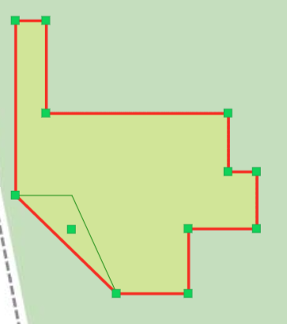
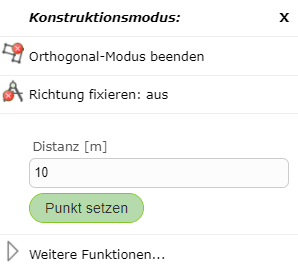

Segementerstellungs Modus
=========================

Gerade
------

*Gerade* stellt den Standardmodus dar. In diesem Modus können neue Vertices beliebig ohne Zwang gesetzt werden.

Orthogonalmodus
---------------

Eine weitere Möglichkeit rechtwinklige/orthogonale Kanten zu zeichnen, bietet der Orthogonalmodus. Im Orthogonalmodus können beliebig viele orthogonale Kanten gezeichnet werden.

Klickt man im Orthogonalmodus mit rechter Maustaste in die Karte erscheint folgendes Fenster, mit welchem man eine bestimmte Distanz für den nächsten Punkt im Bezug auf den zuletzt gesetzten Punkt eingeben kann.

Beendet wird der Orthogonalmodus mittels rechter Mausklick in die Karte und *Orthogonal-Modus beenden*.

Trace-Modus
-----------

Mit dem *Trace-Modus* können snapbare Kanten nachgezeichnet werden. 
Dafür muss mit der rechten Maustaste in die Karte geklickt werden und dann *Trace-Modus starten* unter Sgementerstellungs Modus gewählt werden.
Nachdem der erste Knoten auf einen Endpunkt der Kante gesetzt wurde, kann mit der Maus über Knoten des selben Themas gefahren werden. Es wird dann der kürzeste Weg über die Linien des Themas angezeigt.

Im folgendem Beispiel wurde so eine Linie entlang der Grundstücksgrenze gezeichnet.

.. image:: img/snapping10.png

Über rechte Maustaste in die Karte und *Trace-Modus beenden* kann der Trace-Modus wieder beendet werden.