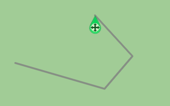
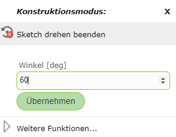
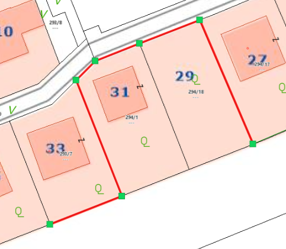
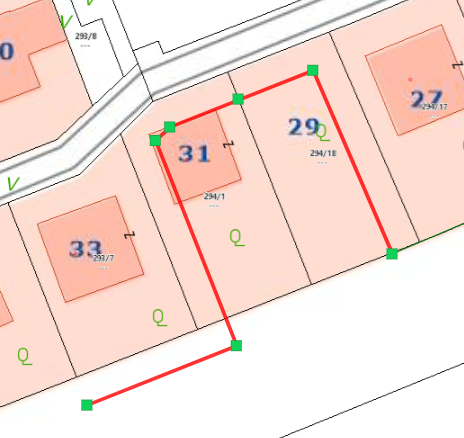
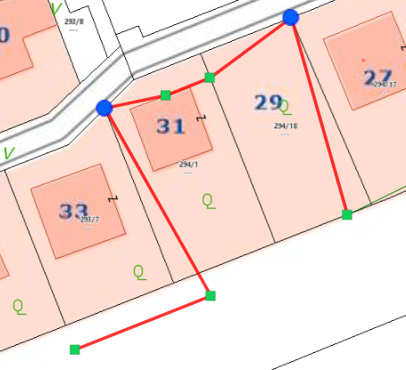
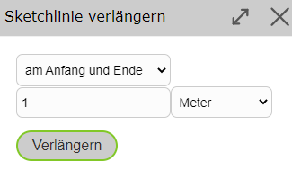

Sketch Werkzeuge
================

   .. image:: img/sketch0.png

Vertexreihenfolge umkehren
--------------------------

Mit Vertexreihenfolge umkehren kann bei einem Linien Sketch der Endpunkt mit dem Startpunkt umgekehrt werden. Es kann dadurch am anderen Ende der Linie weitergezeichnet werden.

Sketch verschieben
------------------

Wenn man mit der rechten Maustaste auf einen Vertex des Sketches klickt, kann man den gesamten Sketch mit *Sketch verschieben* verschieben.
Es erscheint dann ein Symbol, mit welchem man dann den Sketch mit gedrückter Maustaste verschieben kann.

Sketch drehen
-------------

Bei *Sketch drehen* gibt es zwei Optionen: Entweder man setzt den rechten Mausklick auf einen Vertex oder auf eine Kante des Sketches.

* **Vertex:** Dabei fallt die Bezugsrichtung des Drehwinkels auf die Koordinatenachse in Richtung Osten und der gewählte Vertex wird zum Drehpunkt. Damit kann der Sketch um einen Absolutwert gedreht werden.

   .. image:: img/sketch9.png

* **Kante:** Dabei wird die gewählte Kante der Nullrichtung nach Osten zugeordnet. Somit kann der Sketch anhand der Kante gedreht werden, wobei der Startpunkt der Kante dem Drehpunkt entspricht.

   .. image:: img/sketch8.png

Über einen rechten Mausklick in die Karte kann auch in beiden Fällen direkt ein Winkelwert in Grad eingegeben werden.

Sketch parallel versetzen ...
-----------------------------

Mittels *Sketch parallel versetzen ...* kann eine Sketch Linie parallel versetzt werden. 
Dazu muss, nachdem eine Sketch Linie gezeichnet wurde, mit der rechten Maustaste auf die Seite des Sketches geklick werden, in welche Richtung der Sketch parallel versetzt werden soll.
Es öffnet sich dann ein Fenster, in welchem sich die Distanz auch noch manuell einstellen lassen würde. Als Defaultwert steht die Distanz des Klickes zum Sketch bereits im Feld.

Falls gewisse Vertices nicht verschoben werden sollen, also fixiert werden sollen, kommt die bereits beschriebene Funktion *Vertex fixieren/anschließen* ins Spiel.
Fixierte Vertices werden nämlich nicht bewegt.

Die Funktionalität soll anhand des folgenden Beispiels verdeutlicht werden (die Sinnhaftigkeit ist dabei außer Acht gelassen).
Hier wurde ein Linien-Sketch entlang dieser Grundstückgrenzen (zuvor auf snapbar gestellt) gezeichnet.

Danach wurde auf der rechten Seite der Linie (von der Linie aus gesehen) der *Sketch parallel versetzen ...* Befehl ausgeführt.

Zur Veranschaulichung der fixierten Punkte wurden in der folgenden Abbildung zuerst zwei Punkte fixiert (blau gekennzeichnet) und danach wieder derselbe *Sketch parallel versetzen ...* Befehl ausgeführt.

Dasselbe Prinzip funktioniert analog auch bei Flächen-Sketches.

Sketch(linie) verlängern
------------------------

Mit *Sketch(linie) verlängern* kann am Anfang, Ende oder an Anfang und Ende der Sketch verlängert werden. Dieses Werkzeug ist nur bei Linien verfügbar.

