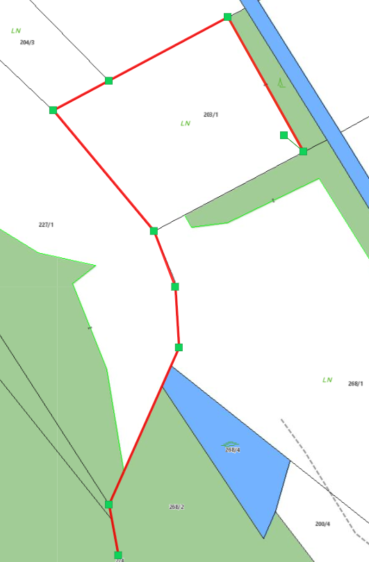
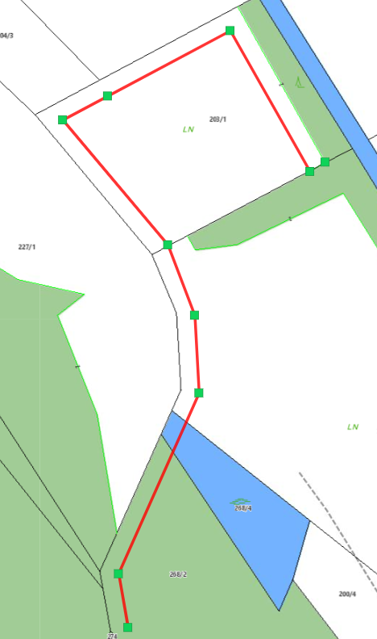

Snapping
========

Über rechte Maustaste (egal ob in Karte oder auf Sketch) und *Snapping ...* kann ausgewählt werden, auf welche Schema der Objektfang (Snapping) aktiviert werden soll.
Des weiteren kann festgelegt werden, ob nur Kanten, Knoten oder Endpunkt snapbar sind.

.. image:: img/snapping1.png

Bei aktiviertem Snapping scheinen dann unter Konstruieren noch weitere Optionen auf, welche hier genauer erläutert werden.

.. image:: img/snapping2.png

Trace-Modus starten
-------------------

Snapbare Linien werden dann gelb dargestellt, wenn man mit der Maus in deren Nähe fahrt.

Richtung fixieren, parallel
---------------------------

Mit dieser Option können zB Linien verlängert werden.
Dafür muss mit der rechten Maustaste auf die zu verlängernde Linie geklickt werden und dann *Richtung fixieren, parallel* gewählt werden.
Dadurch wird die Verlängerung der Linie in grün dargestellt.

.. image:: img/snapping3.png

Richtung fixieren, Rechtwinklig
-------------------------------

Mit dieser Option kann ähnlich wie beim *Richtung fixieren, parallel* der neue Vertex rechtwinklig auf die zuvor gesetzte Kante positioniert werden.

.. image:: img/snapping4.png

Mittelpunkt Kante
-----------------

Mit dieser Option kann der Mittelpunkt einer snapbaren Kante gewählt werden. 
Dazu muss mit der rechten Maustaste auf die dementsprechende Kante geklickt werden, und dann *Mittelpunkt Kante* gewählt werden.

Distanz fixieren
----------------

Mit *Distanz fixieren* lässt sich die Distanz zwischen dem zuletzt gesetztem Vertex und einem snapbaren Objekt fixieren. Mit Hilfe einer grünen Hilfslinie kann der nächste 
Vertex in der fixierten Distanz platziert werden.
Diese Funktion lässt sich über einen erneuten rechten Mausklick und anschließendem *Distanz fixieren: aus* wieder beenden.

 
Sketch parallel versetzen ...
-----------------------------

