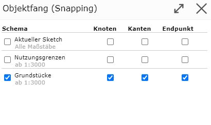
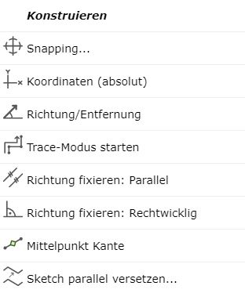
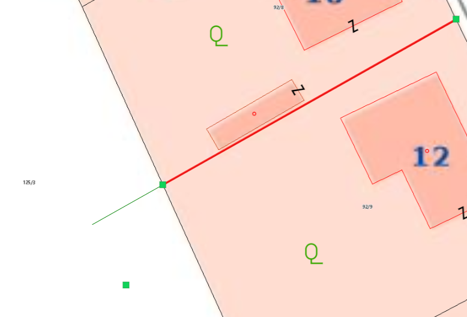
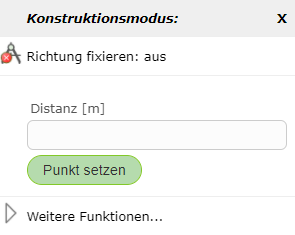
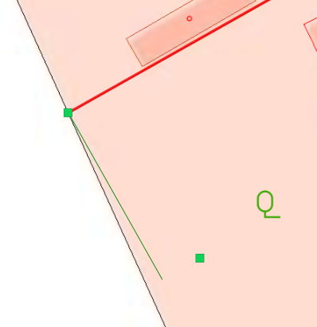

Snapping
========

Über rechte Maustaste (egal ob in Karte oder auf Sketch) und *Snapping ...* kann ausgewählt werden, auf welche Schema der Objektfang (Snapping) aktiviert werden soll.
Des weiteren kann festgelegt werden, ob nur Kanten, Knoten oder Endpunkt snapbar sind. Snapbare Linien werden dann in gelb dargestellt, wenn man mit der Maus in deren Nähe fährt.

Bei aktiviertem Snapping scheinen dann im Menü noch weitere Optionen auf, welche hier genauer erläutert werden.

Mit Kante verschneiden
----------------------

Wenn man eine Distanz oder Richtung fixiert hat, erscheint zusätzlich die Funktion *Mit Kante verschneiden*. Damit kann man den Schnittpunkt einer snapbaren Kante und der fixierten Richtung/Distanz ermitteln.

Mittelpunkt Kante
-----------------

Mit dieser Option kann der Mittelpunkt einer snapbaren Kante gewählt werden. 
Dazu muss mit der rechten Maustaste auf die dementsprechende Kante geklickt werden und dann *Mittelpunkt Kante* gewählt werden.

Richtung fixieren: Parallel
---------------------------

Mit dieser Option können z.B. Linien verlängert werden.
Dafür muss mit der rechten Maustaste auf die zu verlängernde Linie geklickt werden und dann *Richtung fixieren: Parallel* gewählt werden.
Dadurch wird die Verlängerung der Linie in grün dargestellt.

Zudem kann man hierbei auch mit einem weiteren rechten Mausklick in die Karte eine gewünschte Distanz für die Länge der neuen parallelen Kante eingeben.

Richtung fixieren: Rechtwinklig
-------------------------------

Mit dieser Option kann ähnlich wie beim *Richtung fixieren: Parallel* der neue Vertex rechtwinklig auf die zuvor gesetzte Kante positioniert werden.

Distanz fixieren
----------------

Mit *Distanz fixieren* lässt sich die Distanz zwischen dem zuletzt gesetztem Vertex und einem snapbaren Objekt fixieren. Mit Hilfe einer grünen Hilfslinie kann der nächste 
Vertex in der fixierten Distanz platziert werden.
Diese Funktion lässt sich über einen erneuten rechten Mausklick und anschließendem *Distanz fixieren: aus* wieder beenden.

