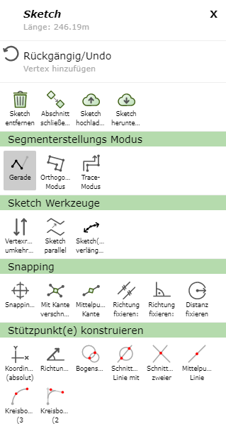

Snapping
========

Über rechte Maustaste (egal ob in Karte oder auf Sketch) und *Snapping ...* kann ausgewählt werden, auf welche Schema der Objektfang (Snapping) aktiviert werden soll.
Des weiteren kann festgelegt werden, ob nur Kanten, Knoten oder Endpunkt snapbar sind. Snapbare Linien werden dann in gelb dargestellt, wenn man mit der Maus in deren Nähe fährt.

.. image:: img/snapping1.png

Bei aktiviertem Snapping scheinen dann unter Konstruieren noch weitere Optionen auf, welche hier genauer erläutert werden.

Trace-Modus starten
-------------------

Mit dem *Trace-Modus* können snapbare Kanten verfolgt werden. 
Dafür muss mit der rechten Maustaste in die Karte geklickt werden und dann *Trace-Modus starten* gewählt werden.
Nachdem der erste Knoten auf einen Endpunkt der Kante gesetzt wurde, kann mit der Maus über Knoten des selben Themas gefahren werden. Es wird dann der kürzeste Weg über die Linien des Themas angezeigt.

Im folgendem Beispiel wurde so eine Linie entlang der Grundstücksgrenze gezeichnet.

Über rechte Maustaste in die Karte und *Trace-Modus beenden* kann der Trace-Modus wieder beendet werden.

Richtung fixieren, parallel
---------------------------

Mit dieser Option können zB Linien verlängert werden.
Dafür muss mit der rechten Maustaste auf die zu verlängernde Linie geklickt werden und dann *Richtung fixieren, parallel* gewählt werden.
Dadurch wird die Verlängerung der Linie in grün dargestellt.

.. image:: img/snapping3.png

Richtung fixieren, Rechtwinklig
-------------------------------

Mit dieser Option kann ähnlich wie beim *Richtung fixieren, parallel* der neue Vertex rechtwinklig auf die zuvor gesetzte Kante positioniert werden.

.. image:: img/snapping4.png

Mittelpunkt Kante
-----------------

Mit dieser Option kann der Mittelpunkt einer snapbaren Kante gewählt werden. 
Dazu muss mit der rechten Maustaste auf die dementsprechende Kante geklickt werden und dann *Mittelpunkt Kante* gewählt werden.

Distanz fixieren
----------------

Mit *Distanz fixieren* lässt sich die Distanz zwischen dem zuletzt gesetztem Vertex und einem snapbaren Objekt fixieren. Mit Hilfe einer grünen Hilfslinie kann der nächste 
Vertex in der fixierten Distanz platziert werden.
Diese Funktion lässt sich über einen erneuten rechten Mausklick und anschließendem *Distanz fixieren: aus* wieder beenden.

 
Sketch parallel versetzen ...
-----------------------------

Mittels *Sketch parallel versetzen ...* kann eine Sketch Linie parallel versetzt werden. 
Dazu muss, nachdem eine Sketch Linie gezeichnet wurde, mit der rechten Maustaste auf die Seite des Sketches geklick werden, in welche Richtung der Sketch parallel versetzt werden soll.
Es öffnet sich dann ein Fenster, in welchem sich die Distanz auch noch manuell einstellen lassen würde. Als Defaultwert steht die Distanz des Klickes zum Sketch bereits im Feld.

Falls gewisse Vertices nicht verschoben werden sollen, also fixiert werden sollen, kommt die bereits beschriebene Funktion *Vertex fixieren/anschließen* ins Spiel.
Fixierte Vertices werden nämlich nicht bewegt.

Die Funktionalität soll anhand des folgenden Beispiels verdeutlicht werden (die Sinnhaftigkeit ist dabei außer Acht gelassen).
Hier wurde ein Linien-Sketch entlang dieser Grundstückgrenzen (zuvor auf snapbar gestellt) gezeichnet.

.. image:: img/snapping7.png

Danach wurde auf der rechten Seite der Linie (von der Linie aus gesehen) der *Sketch parallel versetzen ...* Befehl ausgeführt.

.. image:: img/snapping9.png

Zur Veranschaulichung der fixierten Punkte wurden in der folgenden Abbildung zuerst zwei Punkte fixiert (blau gekennzeichnet) und danach wieder derselbe *Sketch parallel versetzen ...* Befehl ausgeführt.

.. image:: img/snapping8.png

Dasselbe Prinzip funktioniert analog auch bei Flächen-Sketches.